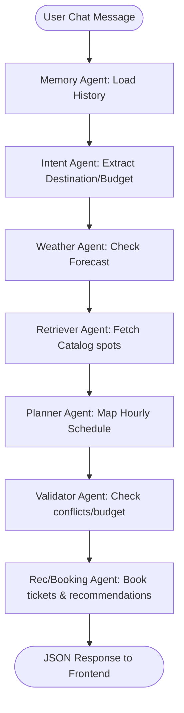
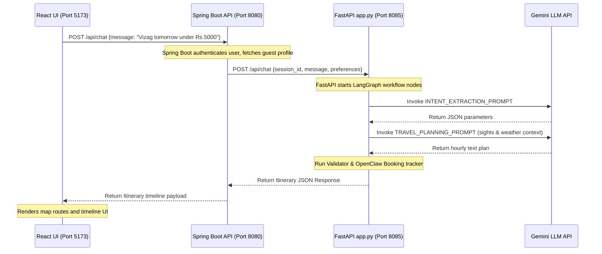

# ConciergeIQ GenAI Travel Concierge Engine

An industry-grade GenAI microservice for **ConciergeIQ - AI Personal Travel Planner**, designed as a final year college engineering project. Built using Python, FastAPI, and Google Gemini API.

---

## 🏗️ System Architecture & Workflow Diagram

This flowchart visualizes how inputs transition through nodes inside the stateful **LangGraph** orchestrator:



### Chronological Integration Sequence (React -> Spring Boot -> FastAPI -> Gemini)



---

## 📁 Folder & File Structure Explained

```
GenAI/
├── app.py                     # Entry point (boots FastAPI server, sets CORS)
├── requirements.txt           # Python dependency packages
├── .env                       # API credentials configuration
├── .env.example               # Config template
├── routes/                    # API Routers
│   ├── chat.py                # Conversational AI assistant
│   ├── itinerary.py           # Day plan timeline builder
│   ├── explore.py             # Sights browser
│   ├── recommendations.py     # Personalized sights ranking
│   └── health.py              # System health check & diagnostics
├── agents/                    # Multi-agent LangGraph nodes
│   ├── travel_agent.py        # Main LangGraph StateGraph coordinator
│   ├── intent_agent.py        # Extracts dates, destination, budget
│   ├── retriever_agent.py     # Filters sights catalog
│   ├── weather_agent.py       # Weather constraints checker
│   ├── budget_agent.py        # Budget auditor
│   ├── planner_agent.py       # Itinerary scheduler
│   ├── validator_agent.py     # Audits schedules for conflicts
│   └── response_agent.py      # Output JSON formatter
├── services/                  # Business services
│   ├── maps.py                # Spatial API (distances/ETAs)
│   ├── weather.py             # Forecast retriever (OpenWeather/OpenMeteo)
│   ├── budget.py              # Spending calculations
│   ├── recommendations.py     # Sights suggester
│   ├── search.py              # Live search
│   ├── booking.py             # OpenClaw Booking reservations engine
│   ├── notifications.py       # Alerts generator
│   └── cache.py               # API request caching
├── models/                    # Pydantic schemas (schemas.py)
├── memory/                    # SQLite database message manager (manager.py)
├── vector_db/                 # TF-IDF keyword vector store catalog (store.py)
├── prompts/                   # Prompt templates (templates.py)
├── utils/                     # Logger (logger.py)
├── viva_explanation.md        # Technical project viva guidelines
├── interview_questions.md     # Project interview questions
└── api_keys_guide.md          # Free API key setup instructions
```

---

## 🚀 Installation & Host Execution (No Docker)

### 1. Prerequisites
Ensure you have **Python 3.12** installed on your host machine.

### 2. Configure Environment
Create a copy of `.env.example` named `.env` and fill in your Gemini and Maps keys:
```env
GEMINI_API_KEY=your_gemini_key_here
GOOGLE_MAPS_API_KEY=your_maps_key_here
OPENWEATHER_API_KEY=your_weather_key_here
```
*For directions on obtaining keys for free, read [api_keys_guide.md](api_keys_guide.md).*

### 3. Setup Virtual Environment
Run the following in your terminal inside the `GenAI/` folder:
```cmd
python -m venv venv
venv\Scripts\activate
pip install -r requirements.txt
```

### 4. Run the Concierge Engine
```cmd
python app.py
```
*The microservice will boot and run on `http://127.0.0.1:8085`.*

---

## ☁️ AWS Cloud Deployment Guide

For production, the GenAI microservice can be deployed to **AWS** as follows:

1. **Dockerize**: Build the Docker container using a Python 3.12 slim base image.
2. **Container Host**: Deploy the container to **AWS ECS Fargate** (Serverless container deployment). 
3. **Load Balancer**: Configure an **Application Load Balancer (ALB)** in front of the ECS service to route `/api/*` traffic.
4. **Environment Variables**: Configure API Keys inside **AWS Systems Manager Parameter Store** or **Secrets Manager**, injecting them securely into the ECS task definition.
